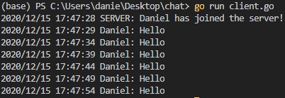
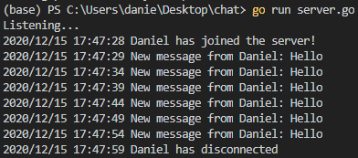

# Simple gRPC chat

The simplest chat service I could make using gRPC. There's an RPC to send messages, and one to receive messages using a stream.
All clients who are using the "Receive" RPC will receive the messages from a "Send" RPC from other clients.

```proto3
message Message {
    string username = 1;
    string message = 2;
}

message Join {
    string username = 1;
}

service ChatService {
    rpc Send(Message) returns (google.protobuf.Empty) {}
    rpc Receive(Join) returns (stream Message) {}
}
```

[Client](client.go) output when receiving messages



[Server](server.go) output

